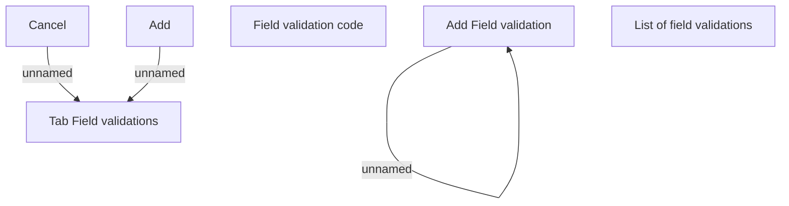

# Tab Field validations

- **Diagram Type**: Custom
- **Package**: HomerSelect/BSL/Analysis Model/Contract Origination/Loan origination configuration /User Interface Model/Subprocess/Subprocess detail/Tab Field validations
- **Diagram ID**: 124338
- **Elements**: 7
- **Connectors**: 3

