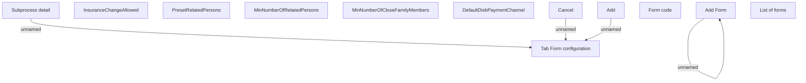

# Tab Form configuration

- **Diagram Type**: Custom
- **Package**: HomerSelect/BSL/Analysis Model/Contract Origination/Loan origination configuration /User Interface Model/Subprocess/Subprocess detail/Tab Form configuration
- **Diagram ID**: 124339
- **Elements**: 13
- **Connectors**: 4

