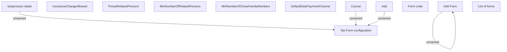

# Tab Form configuration

```mermaid
graph TD
    Subprocess_detail["Subprocess detail"]
    InsuranceChangeAllowed["InsuranceChangeAllowed"]
    PresetRelatedPersons["PresetRelatedPersons"]
    MinNumberOfRelatedPersons["MinNumberOfRelatedPersons"]
    MinNumberOfCloseFamilyMembers["MinNumberOfCloseFamilyMembers"]
    DefaultDisbPaymentChannel["DefaultDisbPaymentChannel"]
    Cancel["Cancel"]
    Add["Add"]
    Form_code["Form code"]
    Add_Form["Add Form"]
    Add_Form["Add Form"]
    List_of_forms["List of forms"]
    Tab_Form_configuration["Tab Form configuration"]
    Subprocess_detail -->|unnamed| Tab_Form_configuration
    Cancel -->|unnamed| Tab_Form_configuration
    Add -->|unnamed| Tab_Form_configuration
    Add_Form -->|unnamed| Add_Form
```
