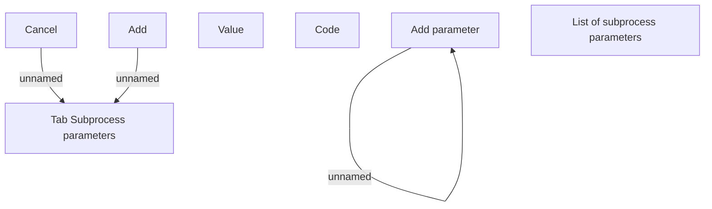

# Tab Subprocess parameters

- **Diagram Type**: Custom
- **Package**: HomerSelect/BSL/Analysis Model/Contract Origination/Loan origination configuration /User Interface Model/Subprocess/Subprocess detail/Tab Subprocess parameters
- **Diagram ID**: 124340
- **Elements**: 8
- **Connectors**: 3

