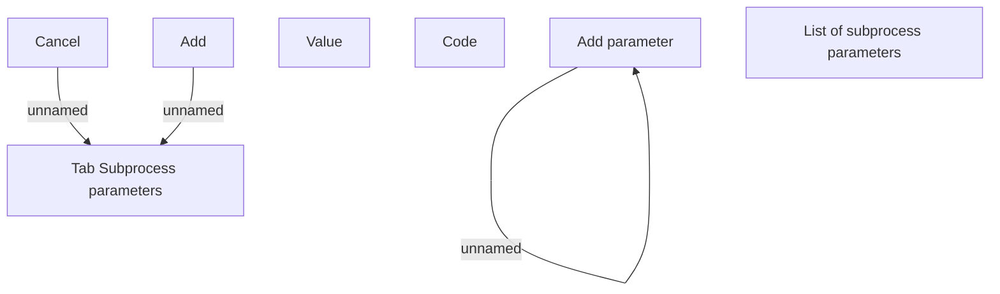

# Tab Subprocess parameters

```mermaid
graph TD
    Cancel["Cancel"]
    Add["Add"]
    Value["Value"]
    Code["Code"]
    Add_parameter["Add parameter"]
    List_of_subprocess_parameters["List of subprocess parameters"]
    Add_parameter["Add parameter"]
    Tab_Subprocess_parameters["Tab Subprocess parameters"]
    Cancel -->|unnamed| Tab_Subprocess_parameters
    Add -->|unnamed| Tab_Subprocess_parameters
    Add_parameter -->|unnamed| Add_parameter
```
