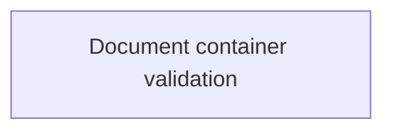

# Validations

- **Diagram Type**: Custom
- **Package**: HomerSelect/BSL/Analysis Model/Contract Origination/Loan origination configuration /Validations
- **Diagram ID**: 112665
- **Elements**: 1
- **Connectors**: 0

