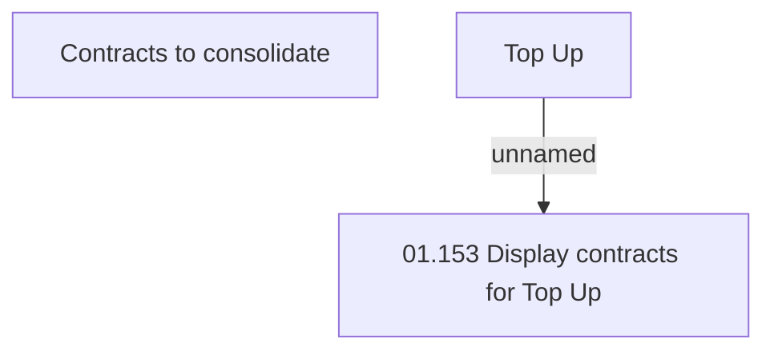

# User Interface Model

- **Diagram Type**: Custom
- **Package**: HomerSelect/BSL/Analysis Model/Contract Origination/Manage Product Offer/Top up/User Interface Model
- **Diagram ID**: 158397
- **Elements**: 3
- **Connectors**: 1

