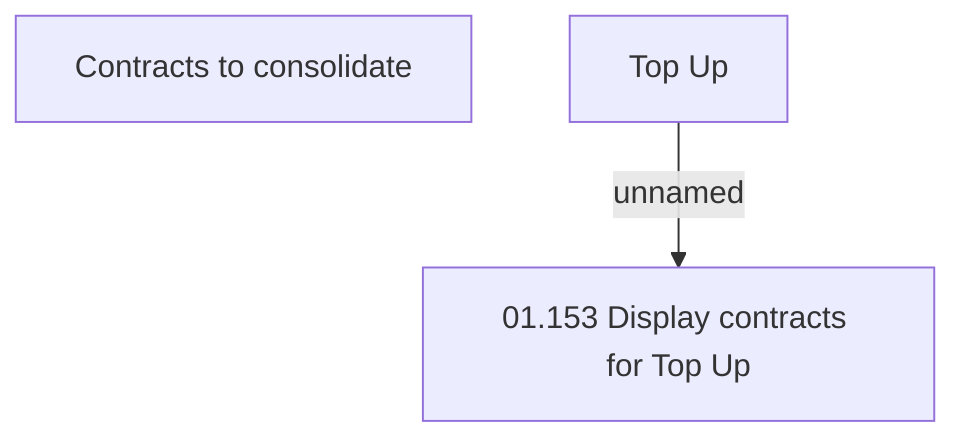

# User Interface Model

```mermaid
graph TD
    n_01_153_Display_contracts_for_Top_Up["01.153 Display contracts for Top Up"]
    Contracts_to_consolidate["Contracts to consolidate"]
    Top_Up["Top Up"]
    Top_Up -->|unnamed| n_01_153_Display_contracts_for_Top_Up
```
