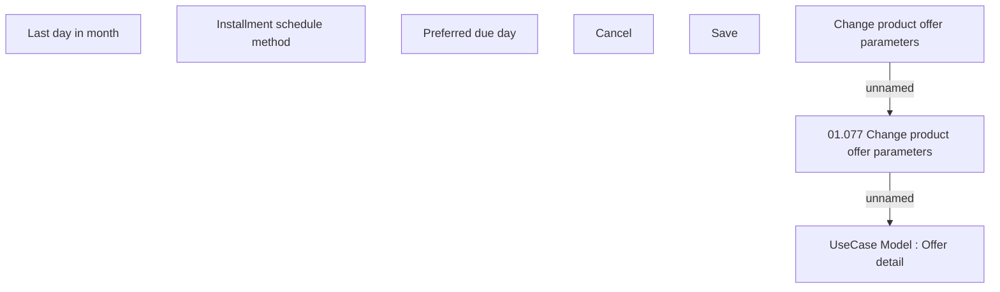

# Change product offer parameters

```mermaid
graph TD
    Last_day_in_month["Last day in month"]
    Installment_schedule_method["Installment schedule method"]
    UseCase_Model_Offer_detail["UseCase Model : Offer detail"]
    Preferred_due_day["Preferred due day"]
    Cancel["Cancel"]
    Save["Save"]
    Change_product_offer_parameters["Change product offer parameters"]
    n_01_077_Change_product_offer_parameters["01.077 Change product offer parameters"]
    Change_product_offer_parameters -->|unnamed| n_01_077_Change_product_offer_parameters
    n_01_077_Change_product_offer_parameters -->|unnamed| UseCase_Model_Offer_detail
```
