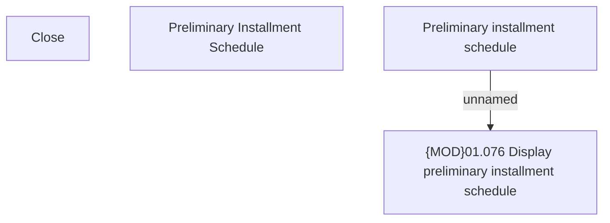

# Preliminary Installment Schedule

- **Diagram Type**: Custom
- **Package**: HomerSelect/BSL/Analysis Model/Contract Origination/Manage Product Offer/User Interface Model
- **Diagram ID**: 144565
- **Elements**: 4
- **Connectors**: 1

