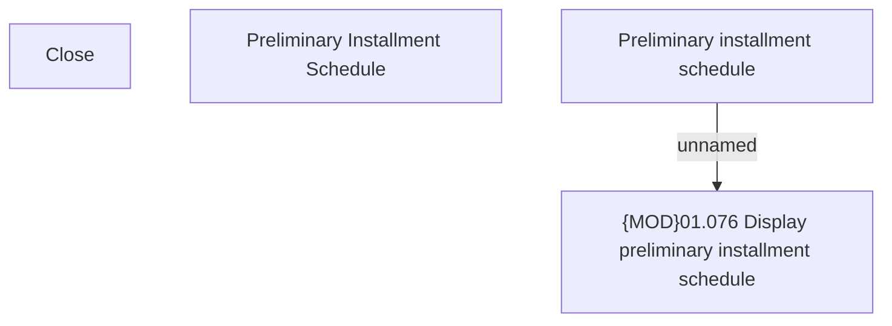

# Preliminary Installment Schedule

```mermaid
graph TD
    MOD_01_076_Display_preliminary_installment_schedule["{MOD}01.076 Display preliminary installment schedule"]
    Close["Close"]
    Preliminary_Installment_Schedule["Preliminary Installment Schedule"]
    Preliminary_installment_schedule["Preliminary installment schedule"]
    Preliminary_installment_schedule -->|unnamed| MOD_01_076_Display_preliminary_installment_schedule
```
