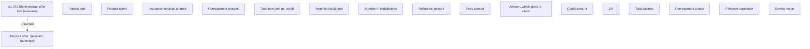

# Product offer detail info (overview)

```mermaid
graph TD
    n_01_071_Show_product_offer_info_overview["01.071 Show product offer info (overview)"]
    Interest_rate["Interest rate"]
    Product_name["Product name"]
    Insurance_services_amount["Insurance services amount"]
    Overpayment_amount["Overpayment amount"]
    Total_payment_per_credit["Total payment per credit"]
    Monthly_installment["Monthly installment"]
    Number_of_installments["Number of installments"]
    Refinance_amount["Refinance amount"]
    Fees_amount["Fees amount"]
    Amount_which_goes_to_client["Amount, which goes to client"]
    Credit_amount["Credit amount"]
    OK["OK"]
    Total_savings["Total savings"]
    Overpayment_amout["Overpayment amout"]
    Relevant_parameter["Relevant parameter"]
    Service_name["Service name"]
    Product_offer_detail_info_overview["Product offer  detail info (overview)"]
    n_01_071_Show_product_offer_info_overview -->|unnamed| Product_offer_detail_info_overview
```
