# Card information (Alternative offer additional data) - PH

- **Diagram Type**: Custom
- **Package**: HomerSelect/BSL/Analysis Model/Contract Origination/Manage Product Offer/User Interface Model/Alternative offer additional data/PH/Card information (Alternative offer additional data) - PH
- **Diagram ID**: 125024
- **Elements**: 17
- **Connectors**: 0

```mermaid
graph TD
    Landmark["Landmark"]
    Zip_code["Zip code"]
    Unit_floor_building_name_and_no_street_name["Unit, floor, building name and no., street name"]
    Municipality_City["Municipality/City"]
    Barangay["Barangay"]
    Province["Province"]
    Cancel["Cancel"]
    OK["OK"]
    Education["Education"]
    Contact_permanent_employer_address["Contact/permanent/employer address"]
    Regular_payment_amount["Regular payment amount"]
    Regular_payment["Regular payment"]
    Statement_channel["Statement channel"]
    Card_delivery_type["Card delivery type"]
    Card_issue_method["Card issue method"]
    Card_information_Alternative_offer_additional_data_PH["Card information (Alternative offer additional data) - PH"]
    Card_information_Alternative_offer_additional_data["Card information (Alternative offer additional data)"]
```

