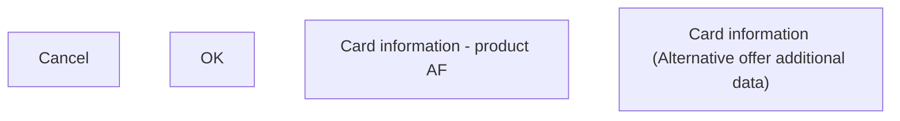

# Card information (Alternative offer additional data)

- **Diagram Type**: Custom
- **Package**: HomerSelect/BSL/Analysis Model/Contract Origination/Manage Product Offer/User Interface Model/Alternative offer additional data/Product/Card information (Alternative offer additional data)
- **Diagram ID**: 133250
- **Elements**: 4
- **Connectors**: 0

