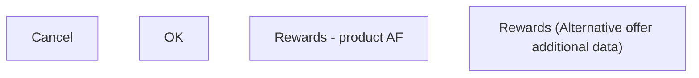

# Rewards (Alternative offer additional data)

- **Diagram Type**: Custom
- **Package**: HomerSelect/BSL/Analysis Model/Contract Origination/Manage Product Offer/User Interface Model/Alternative offer additional data/Product/Rewards (Alternative offer additional data)
- **Diagram ID**: 133251
- **Elements**: 4
- **Connectors**: 0

