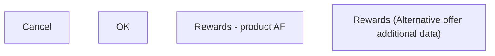

# Rewards (Alternative offer additional data)

```mermaid
graph TD
    Cancel["Cancel"]
    OK["OK"]
    Rewards_product_AF["Rewards - product AF"]
    Rewards_Alternative_offer_additional_data["Rewards (Alternative offer additional data)"]
```
