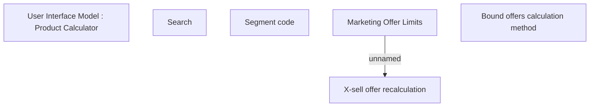

# Bound offers calculation method

```mermaid
graph TD
    X_sell_offer_recalculation["X-sell offer recalculation"]
    User_Interface_Model_Product_Calculator["User Interface Model : Product Calculator"]
    Search["Search"]
    Segment_code["Segment code"]
    Marketing_Offer_Limits["Marketing Offer Limits"]
    Bound_offers_calculation_method["Bound offers calculation method"]
    Marketing_Offer_Limits -->|unnamed| X_sell_offer_recalculation
```
