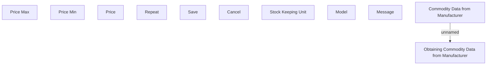

# Commodity Data from Manufacturer

```mermaid
graph TD
    Price_Max["Price Max"]
    Price_Min["Price Min"]
    Price["Price"]
    Repeat["Repeat"]
    Save["Save"]
    Cancel["Cancel"]
    Stock_Keeping_Unit["Stock Keeping Unit"]
    Model["Model"]
    Message["Message"]
    Obtaining_Commodity_Data_from_Manufacturer["Obtaining Commodity Data from Manufacturer"]
    Commodity_Data_from_Manufacturer["Commodity Data from Manufacturer"]
    Commodity_Data_from_Manufacturer -->|unnamed| Obtaining_Commodity_Data_from_Manufacturer
```
