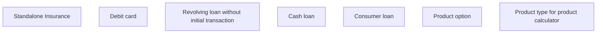

# Product Type for Calculation Method

- **Diagram Type**: Custom
- **Package**: HomerSelect/BSL/Analysis Model/Contract Origination/Manage Product Offer/User Interface Model/Choose Product Offer
- **Diagram ID**: 158555
- **Elements**: 7
- **Connectors**: 0

