# Standard calculation method

- **Diagram Type**: Custom
- **Package**: HomerSelect/BSL/Analysis Model/Contract Origination/Manage Product Offer/User Interface Model/Choose Product Offer
- **Diagram ID**: 158551
- **Elements**: 8
- **Connectors**: 0

```mermaid
graph TD
    Standalone_Insurance["Standalone Insurance"]
    Revolving_loan_without_initial_transaction["Revolving loan without initial transaction"]
    Debit_card["Debit card"]
    Consumer_loan["Consumer loan"]
    Cash_loan["Cash loan"]
    Product_type_for_product_calculator["Product type for product calculator"]
    User_Interface_Model_Product_Calculator["User Interface Model : Product Calculator"]
    Standard_calculation_method["Standard calculation method"]
```

