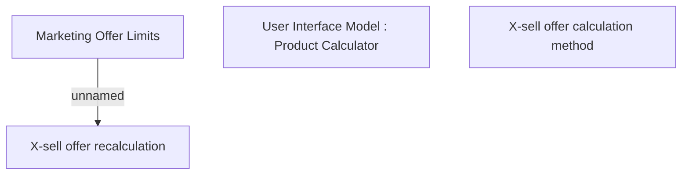

# X-sell offers calculation method

- **Diagram Type**: Custom
- **Package**: HomerSelect/BSL/Analysis Model/Contract Origination/Manage Product Offer/User Interface Model/Choose Product Offer
- **Diagram ID**: 158553
- **Elements**: 4
- **Connectors**: 1

