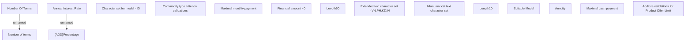

# Validation Rules

```mermaid
graph TD
    Number_Of_Terms["Number Of Terms"]
    Annual_Interest_Rate["Annual Interest Rate"]
    ADD_Percentage["{ADD}Percentage"]
    Character_set_for_model_ID["Character set for model - ID"]
    Commodity_type_criterion_validations["Commodity type criterion validations"]
    Maximal_monthly_payment["Maximal monthly payment"]
    Financial_amount_0["Financial amount › 0"]
    Length50["Length50"]
    Extended_text_character_set_VN_PH_KZ_IN["Extended text character set - VN,PH,KZ,IN"]
    Number_of_terms["Number of terms"]
    Alfanumerical_text_character_set["Alfanumerical text character set"]
    Length10["Length10"]
    Editable_Model["Editable Model"]
    Annuity["Annuity "]
    Maximal_cash_payment["Maximal cash payment"]
    Additive_validations_for_Product_Offer_Limit["Additive validations for Product Offer Limit"]
    Number_Of_Terms -->|unnamed| Number_of_terms
    Annual_Interest_Rate -->|unnamed| ADD_Percentage
```
