# India

- **Diagram Type**: Custom
- **Package**: HomerSelect/BSL/Analysis Model/Contract Origination/Manage Product Offer/User Interface Model/Choose Product Offer/X-sell offer recalculation/India
- **Diagram ID**: 153544
- **Elements**: 15
- **Connectors**: 0

```mermaid
graph TD
    Economical_status["Economical status"]
    Result["Result"]
    Countdown["Countdown"]
    Verify_code["Verify code"]
    Verification_code["Verification code"]
    Contact_under_verification["Contact under verification"]
    Generate_verification_code["Generate verification code"]
    OTP["OTP"]
    Recalculate["Recalculate"]
    Consent_status["Consent status"]
    Check_consent["Check consent"]
    Consent_initialization_status["Consent initialization status"]
    Initiate_consent["Initiate consent"]
    Vodafone_Number["Vodafone Number"]
    X_sell_offer_recalculation_IN["X-sell offer recalculation - IN"]
```

