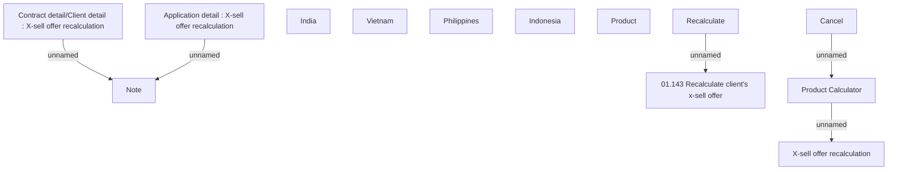

# X-sell offer recalculation

```mermaid
graph TD
    Application_detail_X_sell_offer_recalculation["Application detail : X-sell offer recalculation"]
    Contract_detail_Client_detail_X_sell_offer_recalculation["Contract detail/Client detail : X-sell offer recalculation"]
    el_1761920["Note"]
    India["India"]
    Vietnam["Vietnam"]
    Philippines["Philippines"]
    Indonesia["Indonesia"]
    Product["Product"]
    n_01_143_Recalculate_client_s_x_sell_offer["01.143 Recalculate client's x-sell offer"]
    Product_Calculator["Product Calculator"]
    Cancel["Cancel"]
    Recalculate["Recalculate"]
    X_sell_offer_recalculation["X-sell offer recalculation"]
    Product_Calculator -->|unnamed| X_sell_offer_recalculation
    Cancel -->|unnamed| Product_Calculator
    Recalculate -->|unnamed| n_01_143_Recalculate_client_s_x_sell_offer
    Contract_detail_Client_detail_X_sell_offer_recalculation -->|unnamed| el_1761920
    Application_detail_X_sell_offer_recalculation -->|unnamed| el_1761920
```
