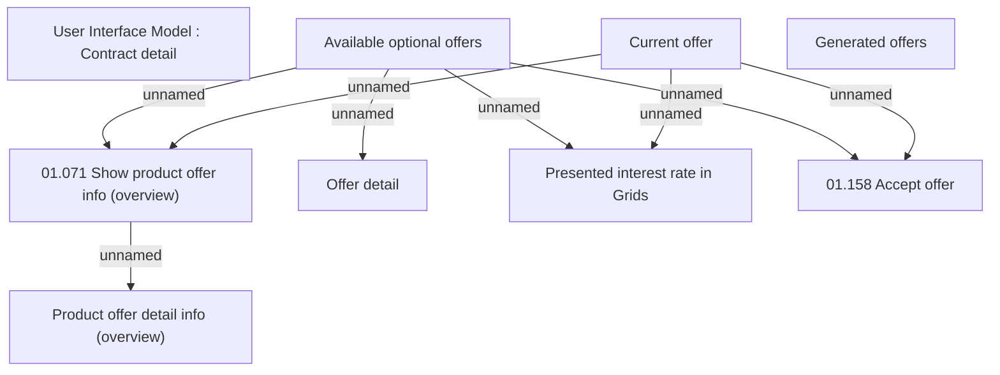

# Product Offers in Contract detail

```mermaid
graph TD
    Product_offer_detail_info_overview["Product offer detail info (overview)"]
    n_01_071_Show_product_offer_info_overview["01.071 Show product offer info (overview)"]
    User_Interface_Model_Contract_detail["User Interface Model : Contract detail"]
    Offer_detail["Offer detail"]
    Presented_interest_rate_in_Grids["Presented interest rate in Grids"]
    n_01_158_Accept_offer["01.158 Accept offer"]
    Current_offer["Current offer"]
    Available_optional_offers["Available optional offers"]
    Generated_offers["Generated offers"]
    Available_optional_offers -->|unnamed| n_01_158_Accept_offer
    Available_optional_offers -->|unnamed| n_01_071_Show_product_offer_info_overview
    Available_optional_offers -->|unnamed| Offer_detail
    Available_optional_offers -->|unnamed| Presented_interest_rate_in_Grids
    Current_offer -->|unnamed| Presented_interest_rate_in_Grids
    Current_offer -->|unnamed| n_01_158_Accept_offer
    Current_offer -->|unnamed| n_01_071_Show_product_offer_info_overview
    n_01_071_Show_product_offer_info_overview -->|unnamed| Product_offer_detail_info_overview
```
