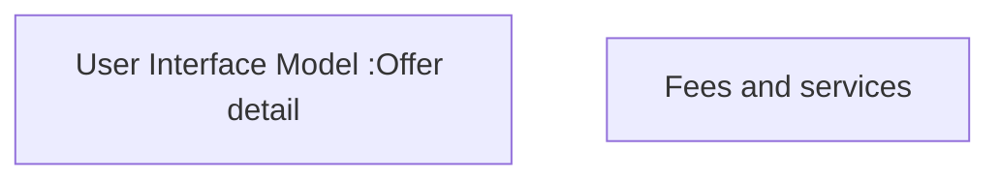

# Offer detail - Fees and services

- **Diagram Type**: Custom
- **Package**: HomerSelect/BSL/Analysis Model/Contract Origination/Manage Product Offer/User Interface Model/Offer Detail
- **Diagram ID**: 151917
- **Elements**: 2
- **Connectors**: 0

