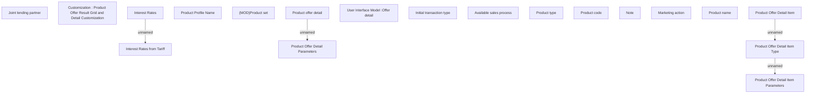

# Offer detail - Financial parameters

```mermaid
graph TD
    Joint_lending_partner["Joint lending partner"]
    Customization_Product_Offer_Result_Grid_and_Detail_Customiza["Customization : Product Offer Result Grid and Detail Customization"]
    Interest_Rates["Interest Rates"]
    Interest_Rates_from_Tariff["Interest Rates from Tariff"]
    Product_Offer_Detail_Item_Parameters["Product Offer Detail Item Parameters"]
    Product_Offer_Detail_Parameters["Product Offer Detail Parameters"]
    Product_Profile_Name["Product Profile Name"]
    MOD_Product_set["{MOD}Product set"]
    Product_Offer_Detail_Item["Product Offer Detail Item"]
    Product_Offer_Detail_Item_Type["Product Offer Detail Item Type"]
    User_Interface_Model_Offer_detail["User Interface Model :Offer detail"]
    Initial_transaction_type["Initial transaction type"]
    Available_sales_process["Available sales process"]
    Product_type["Product type"]
    Product_code["Product code"]
    Note["Note"]
    Marketing_action["Marketing action"]
    Product_name["Product name"]
    Product_offer_detail["Product offer detail"]
    Product_offer_detail -->|unnamed| Product_Offer_Detail_Parameters
    Product_Offer_Detail_Item_Type -->|unnamed| Product_Offer_Detail_Item_Parameters
    Product_Offer_Detail_Item -->|unnamed| Product_Offer_Detail_Item_Type
    Interest_Rates -->|unnamed| Interest_Rates_from_Tariff
```
