# Offer detail - Panel of buttons

- **Diagram Type**: Custom
- **Package**: HomerSelect/BSL/Analysis Model/Contract Origination/Manage Product Offer/User Interface Model/Offer Detail
- **Diagram ID**: 151919
- **Elements**: 28
- **Connectors**: 18

```mermaid
graph TD
    Card_information_product_AF["Card information - product AF"]
    Refuse_new_offers["Refuse new offers"]
    Choose_product_offer["Choose product offer"]
    n_01_080_Fill_in_application["01.080 Fill in application"]
    MOD_01_082_Fill_in_application_1BoD["{MOD}01.082 Fill in application - 1BoD"]
    MOD_01_081_Fill_in_application_1SP["{MOD}01.081 Fill in application - 1SP"]
    n_01_157_Save_adjusted_offer["01.157 Save adjusted offer"]
    User_Interface_Model_Adjust_Credit_Limit["User Interface Model : Adjust Credit Limit"]
    Save_adjusted_offer["Save adjusted offer"]
    n_01_156_Adjust_credit_limit["01.156 Adjust credit limit"]
    Adjust_credit_limit["Adjust credit limit"]
    Accept_offer["Accept offer"]
    MOD_01_159_Reject_offer["{MOD}01.159 Reject offer"]
    n_01_158_Accept_offer["01.158 Accept offer"]
    Display_preliminary_installment_schedule["Display preliminary installment schedule"]
    MOD_Sent_to_evaluation["{MOD}Sent to evaluation"]
    User_Interface_Model_Change_product_offer_parameters["User Interface Model : Change product offer parameters"]
    Insurance_services_selection_Insurance_services_selection["Insurance services selection : Insurance services selection"]
    Change_product_offer_parameters["Change product offer parameters"]
    n_01_077_Change_product_offer_parameters["01.077 Change product offer parameters"]
    MOD_01_076_Display_preliminary_installment_schedule["{MOD}01.076 Display preliminary installment schedule"]
    MOD_01_075_Print_product_offer_detail["{MOD}01.075 Print product offer detail"]
    n_08_110_Select_insurance_services["08.110 Select insurance services"]
    Select_insurance["Select insurance"]
    Back["Back"]
    Fill_in_application["Fill in application"]
    Print_product_offer_details["Print product offer details"]
    Detail_buttons["Detail buttons"]
    Insurance_services_selection_Insurance_services_selection -->|unnamed| n_08_110_Select_insurance_services
    MOD_01_081_Fill_in_application_1SP -->|unnamed| n_01_080_Fill_in_application
    Save_adjusted_offer -->|unnamed| n_01_157_Save_adjusted_offer
    Adjust_credit_limit -->|unnamed| n_01_156_Adjust_credit_limit
    Accept_offer -->|unnamed| n_01_158_Accept_offer
    Accept_offer -->|For REL in process| Card_information_product_AF
    Refuse_new_offers -->|unnamed| MOD_01_159_Reject_offer
    MOD_Sent_to_evaluation -->|unnamed| n_01_080_Fill_in_application
    Print_product_offer_details -->|unnamed| MOD_01_075_Print_product_offer_detail
    Change_product_offer_parameters -->|unnamed| n_01_077_Change_product_offer_parameters
    Select_insurance -->|unnamed| n_08_110_Select_insurance_services
    Back -->|Primary Offer| Choose_product_offer
    Fill_in_application -->|unnamed| MOD_01_081_Fill_in_application_1SP
    Fill_in_application -->|unnamed| MOD_01_082_Fill_in_application_1BoD
    Display_preliminary_installment_schedule -->|unnamed| MOD_01_076_Display_preliminary_installment_schedule
    MOD_01_082_Fill_in_application_1BoD -->|unnamed| n_01_080_Fill_in_application
    n_01_156_Adjust_credit_limit -->|unnamed| User_Interface_Model_Adjust_Credit_Limit
    n_01_077_Change_product_offer_parameters -->|unnamed| User_Interface_Model_Change_product_offer_parameters
```

