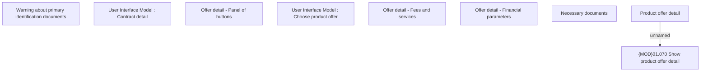

# Offer detail

- **Diagram Type**: Custom
- **Package**: HomerSelect/BSL/Analysis Model/Contract Origination/Manage Product Offer/User Interface Model/Offer Detail
- **Diagram ID**: 151918
- **Elements**: 9
- **Connectors**: 1

