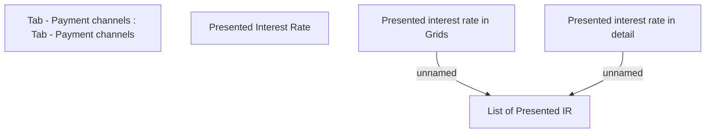

# Presented Interest Rate

```mermaid
graph TD
    Tab_Payment_channels_Tab_Payment_channels["Tab-Payment channels : Tab-Payment channels"]
    Tab_Payment_channels_Tab_Payment_channels["Tab - Payment channels : Tab - Payment channels"]
    List_of_Presented_IR["List of Presented IR"]
    Presented_Interest_Rate["Presented Interest Rate"]
    Presented_interest_rate_in_Grids["Presented interest rate in Grids"]
    Presented_Interest_Rate["Presented Interest Rate"]
    Presented_interest_rate_in_detail["Presented interest rate in detail"]
    Presented_interest_rate_in_Grids -->|unnamed| List_of_Presented_IR
    Presented_interest_rate_in_detail -->|unnamed| List_of_Presented_IR
```
