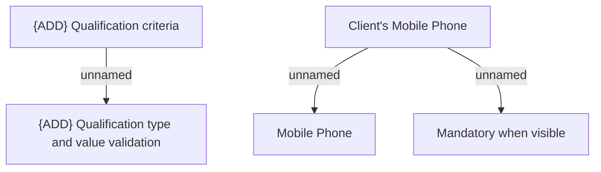

# Qualification criteria

- **Diagram Type**: Custom
- **Package**: HomerSelect/BSL/Analysis Model/Contract Origination/Manage Product Offer/Validation Rules/Qualification criteria
- **Diagram ID**: 155151
- **Elements**: 5
- **Connectors**: 3

