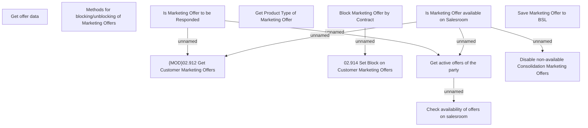

# Business Rules - Marketing Offers

- **Diagram Type**: Custom
- **Package**: HomerSelect/BSL/Analysis Model/Contract Origination/Marketing Offers/Business Rules
- **Diagram ID**: 158067
- **Elements**: 12
- **Connectors**: 7

