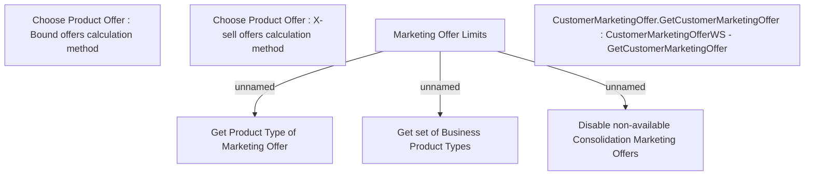

# Marketing Offer Limits

- **Diagram Type**: Custom
- **Package**: HomerSelect/BSL/Analysis Model/Contract Origination/Marketing Offers/User Interface
- **Diagram ID**: 161287
- **Elements**: 7
- **Connectors**: 3

