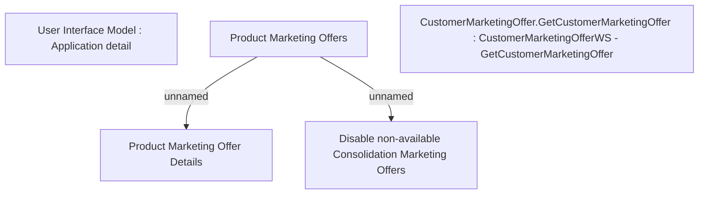

# Product Marketing Offers

```mermaid
graph TD
    User_Interface_Model_Application_detail["User Interface Model : Application detail"]
    Disable_non_available_Consolidation_Marketing_Offers["Disable non-available Consolidation Marketing Offers"]
    Product_Marketing_Offers["Product Marketing Offers"]
    Product_Marketing_Offer_Details["Product Marketing Offer Details"]
    CustomerMarketingOffer_GetCustomerMarketingOffer_CustomerMar["CustomerMarketingOffer.GetCustomerMarketingOffer : CustomerMarketingOfferWS - GetCustomerMarketingOffer"]
    Product_Marketing_Offers -->|unnamed| Product_Marketing_Offer_Details
    Product_Marketing_Offers -->|unnamed| Disable_non_available_Consolidation_Marketing_Offers
```
