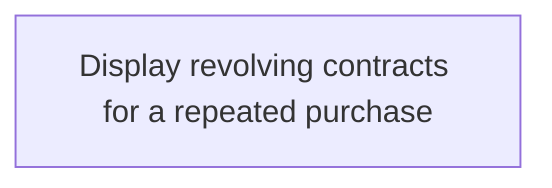

# Business Rules

- **Diagram Type**: Custom
- **Package**: HomerSelect/BSL/Analysis Model/Contract Origination/Repeated POS transaction processing/Business Rules
- **Diagram ID**: 142478
- **Elements**: 1
- **Connectors**: 0

