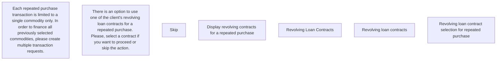

# Revolving loan contract selection

- **Diagram Type**: Custom
- **Package**: HomerSelect/BSL/Analysis Model/Contract Origination/Repeated POS transaction processing/User Interface Model
- **Diagram ID**: 122869
- **Elements**: 7
- **Connectors**: 0

