# Access Rights

- **Diagram Type**: Custom
- **Package**: HomerSelect/BSL/Analysis Model/Contract Origination/Support for 2BoD Processing/Access Rights
- **Diagram ID**: 46684
- **Elements**: 16
- **Connectors**: 12

```mermaid
graph TD
    n_01_027_Switch_contract_2BoD_queue_type["01.027 Switch contract 2BoD queue type"]
    n_01_032_Reschedule_2BoD_call_contract_in_BO_queue["01.032 Reschedule 2BoD call{contract in BO queue)"]
    n_01_032_Reschedule_2BoD_call_contract_in_FO_queue["01.032 Reschedule 2BoD call{contract in FO queue)"]
    n_01_031_Release_assigned_contract_contract_in_BO_queue["01.031 Release assigned contract(contract in BO queue)"]
    n_01_031_Release_assigned_contract_contract_in_FO_queue["01.031 Release assigned contract(contract in FO queue)"]
    n_01_027_Switch_contract_2BoD_queue_type_contract_in_FO_queu["01.027 Switch contract 2BoD queue type (contract in FO queue)"]
    n_01_027_Switch_contract_2BoD_queue_type_contract_in_BO_queu["01.027 Switch contract 2BoD queue type (contract in BO queue)"]
    n_01_033_Show_2BoD_filling_history["01.033 Show 2BoD filling history"]
    n_01_032_Reschedule_2BoD_call["01.032 Reschedule 2BoD call"]
    n_01_031_Release_assigned_contract_all_salesrooms["01.031 Release assigned contract (all salesrooms)"]
    n_01_031_Release_assigned_contract["01.031 Release assigned contract"]
    Access_control_to_Contract_by_Salesroom["Access control to Contract by Salesroom"]
    n_01_033_Show_2BoD_filling_history["01.033 Show 2BoD filling history"]
    n_01_032_Reschedule_2BoD_call["01.032 Reschedule 2BoD call"]
    n_01_031_Release_assigned_contract["01.031 Release assigned contract"]
    n_01_027_Switch_contract_2BoD_queue_type["01.027 Switch contract 2BoD queue type"]
    n_01_033_Show_2BoD_filling_history -->|unnamed| n_01_033_Show_2BoD_filling_history
    n_01_027_Switch_contract_2BoD_queue_type -->|unnamed| n_01_027_Switch_contract_2BoD_queue_type_contract_in_FO_queu
    n_01_027_Switch_contract_2BoD_queue_type -->|unnamed| n_01_027_Switch_contract_2BoD_queue_type_contract_in_BO_queu
    n_01_027_Switch_contract_2BoD_queue_type -->|unnamed| n_01_027_Switch_contract_2BoD_queue_type
    n_01_032_Reschedule_2BoD_call -->|unnamed| n_01_032_Reschedule_2BoD_call
    n_01_032_Reschedule_2BoD_call -->|unnamed| n_01_032_Reschedule_2BoD_call_contract_in_FO_queue
    n_01_032_Reschedule_2BoD_call -->|unnamed| n_01_032_Reschedule_2BoD_call_contract_in_BO_queue
    n_01_031_Release_assigned_contract -->|unnamed| n_01_031_Release_assigned_contract
    n_01_031_Release_assigned_contract -->|unnamed| Access_control_to_Contract_by_Salesroom
    n_01_031_Release_assigned_contract -->|unnamed| n_01_031_Release_assigned_contract_contract_in_BO_queue
    n_01_031_Release_assigned_contract -->|unnamed| n_01_031_Release_assigned_contract_contract_in_FO_queue
    n_01_031_Release_assigned_contract -->|unnamed| n_01_031_Release_assigned_contract_all_salesrooms
```

