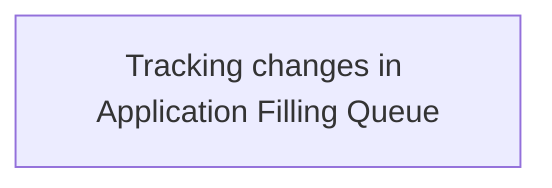

# Business Rules

- **Diagram Type**: Custom
- **Package**: HomerSelect/BSL/Analysis Model/Contract Origination/Support for 2BoD Processing/Business Rules
- **Diagram ID**: 111744
- **Elements**: 1
- **Connectors**: 0

