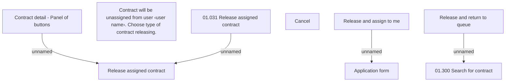

# Release contract

- **Diagram Type**: Custom
- **Package**: HomerSelect/BSL/Analysis Model/Contract Origination/Support for 2BoD Processing/User Interface Model
- **Diagram ID**: 79910
- **Elements**: 9
- **Connectors**: 4

