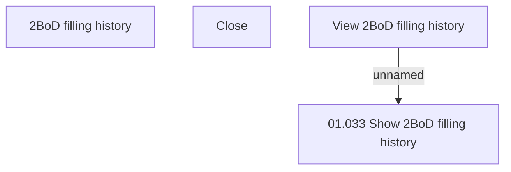

# View 2BoD filling history

- **Diagram Type**: Custom
- **Package**: HomerSelect/BSL/Analysis Model/Contract Origination/Support for 2BoD Processing/User Interface Model
- **Diagram ID**: 79909
- **Elements**: 4
- **Connectors**: 1

