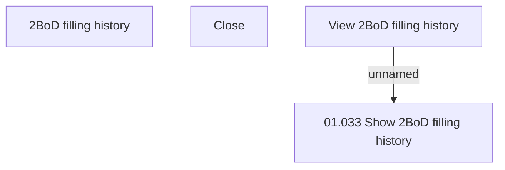

# View 2BoD filling history

```mermaid
graph TD
    n_2BoD_filling_history["2BoD filling history"]
    Close["Close"]
    n_01_033_Show_2BoD_filling_history["01.033 Show 2BoD filling history"]
    View_2BoD_filling_history["View 2BoD filling history"]
    View_2BoD_filling_history -->|unnamed| n_01_033_Show_2BoD_filling_history
```
