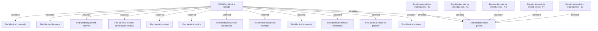

# Update application - Business rules

```mermaid
graph TD
    Find_identical_direct_debit_mandate["Find identical direct debit mandate"]
    Find_identical_payment_channel["Find identical payment channel"]
    Find_identical_extended_property["Find identical extended property"]
    Find_identical_document["Find identical document"]
    Find_identical_commodity["Find identical commodity"]
    Find_identical_insurance_custom_data["Find identical insurance custom data "]
    Find_identical_external_identification_attribute["Find identical external identification attribute"]
    Find_identical_service["Find identical service"]
    Find_identical_extended_information["Find identical extended information"]
    Find_identical_address["Find identical address"]
    Find_identical_contact["Find identical contact"]
    Find_identical_language["Find identical language"]
    MOD_Find_identical_records["{MOD}Find identical records"]
    Equality_data_rule_for_related_person_KZ["Equality data rule for related person - KZ"]
    Equality_data_rule_for_related_person_VN["Equality data rule for related person - VN"]
    Equality_data_rule_for_related_person_PH["Equality data rule for related person - PH"]
    Equality_data_rule_for_related_person_IN["Equality data rule for related person - IN"]
    Equality_data_rule_for_related_person_ID["Equality data rule for related person - ID"]
    Find_identical_related_person["Find identical related person"]
    MOD_Find_identical_records -->|unnamed| Find_identical_address
    MOD_Find_identical_records -->|unnamed| Find_identical_extended_property
    MOD_Find_identical_records -->|unnamed| Find_identical_extended_information
    MOD_Find_identical_records -->|unnamed| Find_identical_document
    MOD_Find_identical_records -->|unnamed| Find_identical_direct_debit_mandate
    MOD_Find_identical_records -->|unnamed| Find_identical_insurance_custom_data
    MOD_Find_identical_records -->|unnamed| Find_identical_service
    MOD_Find_identical_records -->|unnamed| Find_identical_contact
    MOD_Find_identical_records -->|unnamed| Find_identical_external_identification_attribute
    Equality_data_rule_for_related_person_ID -->|unnamed| Find_identical_related_person
    MOD_Find_identical_records -->|unnamed| Find_identical_payment_channel
    MOD_Find_identical_records -->|unnamed| Find_identical_related_person
    MOD_Find_identical_records -->|unnamed| Find_identical_language
    Equality_data_rule_for_related_person_KZ -->|unnamed| Find_identical_related_person
    Equality_data_rule_for_related_person_VN -->|unnamed| Find_identical_related_person
    Equality_data_rule_for_related_person_PH -->|unnamed| Find_identical_related_person
    Equality_data_rule_for_related_person_IN -->|unnamed| Find_identical_related_person
    MOD_Find_identical_records -->|unnamed| Find_identical_commodity
```
