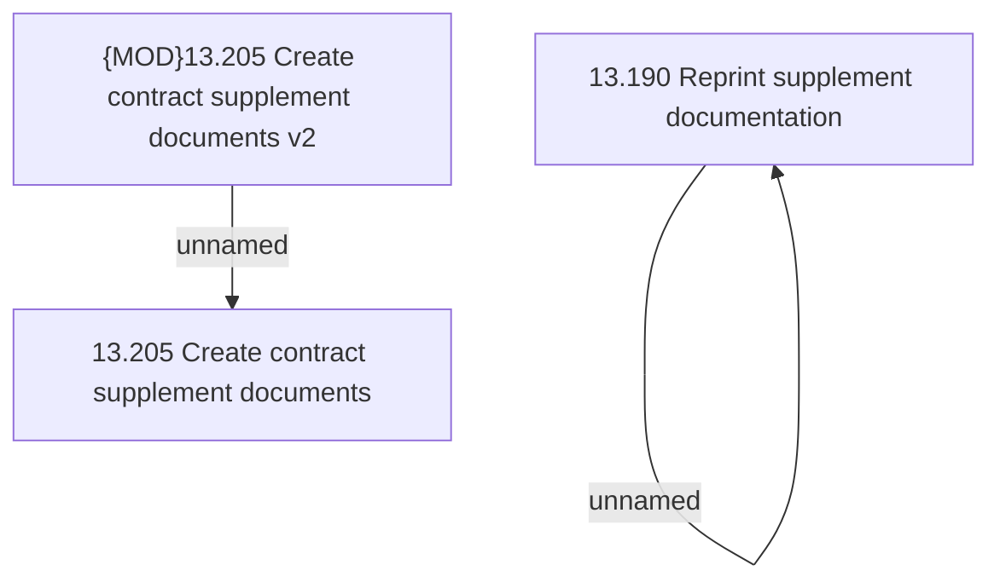

# Access Right

- **Diagram Type**: Custom
- **Package**: HomerSelect/BSL/Analysis Model/Contract Supplements/COMMON for Supplements/Contract Supplement operations/Contract Supplement document management/Access Right
- **Diagram ID**: 162863
- **Elements**: 4
- **Connectors**: 2

