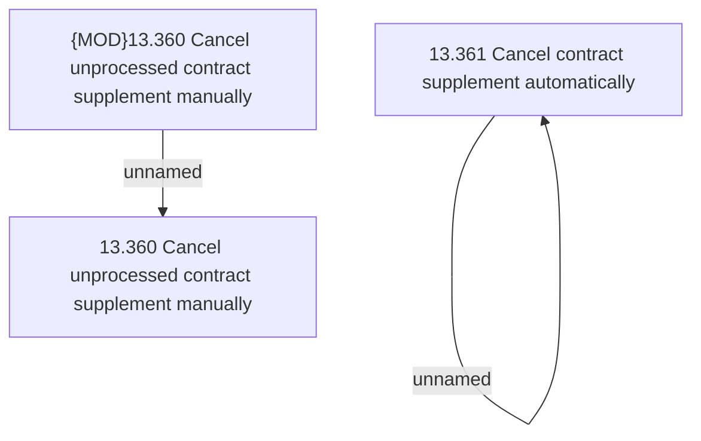

# Access Rights

- **Diagram Type**: Custom
- **Package**: HomerSelect/BSL/Analysis Model/Contract Supplements/COMMON for Supplements/Contract Supplement operations/Contract Supplement management/Access Rights
- **Diagram ID**: 162848
- **Elements**: 4
- **Connectors**: 2

