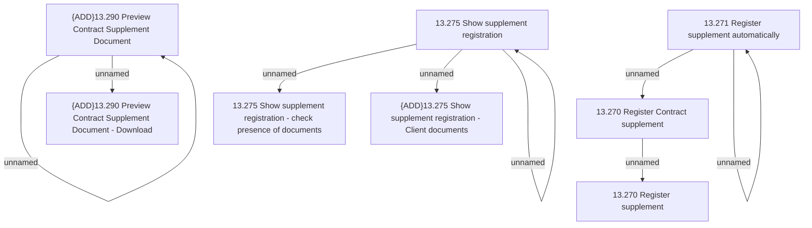

# Access rights

```mermaid
graph TD
    ADD_13_290_Preview_Contract_Supplement_Document_Download["{ADD}13.290 Preview Contract Supplement Document - Download"]
    ADD_13_275_Show_supplement_registration_Client_documents["{ADD}13.275 Show supplement registration - Client documents"]
    ADD_13_290_Preview_Contract_Supplement_Document["{ADD}13.290 Preview Contract Supplement Document"]
    ADD_13_290_Preview_Contract_Supplement_Document["{ADD}13.290 Preview Contract Supplement Document"]
    n_13_271_Register_supplement_automatically["13.271 Register supplement automatically"]
    n_13_271_Register_supplement_automatically["13.271 Register supplement automatically"]
    n_13_275_Show_supplement_registration_check_presence_of_docu["13.275 Show supplement registration - check presence of documents"]
    n_13_270_Register_Contract_supplement["13.270 Register Contract supplement"]
    n_13_275_Show_supplement_registration["13.275 Show supplement registration"]
    n_13_275_Show_supplement_registration["13.275 Show supplement registration"]
    n_13_270_Register_supplement["13.270 Register supplement"]
    ADD_13_290_Preview_Contract_Supplement_Document -->|unnamed| ADD_13_290_Preview_Contract_Supplement_Document
    ADD_13_290_Preview_Contract_Supplement_Document -->|unnamed| ADD_13_290_Preview_Contract_Supplement_Document_Download
    n_13_275_Show_supplement_registration -->|unnamed| n_13_275_Show_supplement_registration_check_presence_of_docu
    n_13_275_Show_supplement_registration -->|unnamed| ADD_13_275_Show_supplement_registration_Client_documents
    n_13_275_Show_supplement_registration -->|unnamed| n_13_275_Show_supplement_registration
    n_13_270_Register_Contract_supplement -->|unnamed| n_13_270_Register_supplement
    n_13_271_Register_supplement_automatically -->|unnamed| n_13_270_Register_Contract_supplement
    n_13_271_Register_supplement_automatically -->|unnamed| n_13_271_Register_supplement_automatically
```
