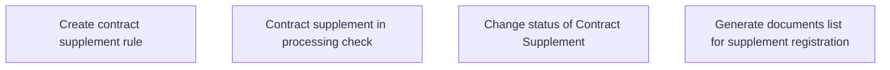

# Business rules

- **Diagram Type**: Custom
- **Package**: HomerSelect/BSL/Analysis Model/Contract Supplements/COMMON for Supplements/Contract Supplement operations/Contract Supplement management/Business rules
- **Diagram ID**: 164452
- **Elements**: 4
- **Connectors**: 0

