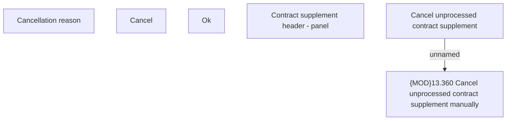

# Cancel unprocessed contract supplement - UI

```mermaid
graph TD
    MOD_13_360_Cancel_unprocessed_contract_supplement_manually["{MOD}13.360 Cancel unprocessed contract supplement manually"]
    Cancellation_reason["Cancellation reason"]
    Cancel["Cancel"]
    Ok["Ok"]
    Contract_supplement_header_panel["Contract supplement header - panel"]
    Cancel_unprocessed_contract_supplement["Cancel unprocessed contract supplement"]
    Cancel_unprocessed_contract_supplement -->|unnamed| MOD_13_360_Cancel_unprocessed_contract_supplement_manually
```
