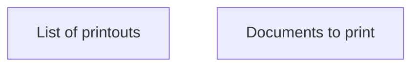

# Contract Supplement printout list

- **Diagram Type**: Custom
- **Package**: HomerSelect/BSL/Analysis Model/Contract Supplements/COMMON for Supplements/Contract Supplement operations/Contract Supplement document management/User Interface Model
- **Diagram ID**: 162862
- **Elements**: 2
- **Connectors**: 0

