# Contract supplement header - panel

- **Diagram Type**: Custom
- **Package**: HomerSelect/BSL/Analysis Model/Contract Supplements/COMMON for Supplements/Contract Supplement operations/Contract Supplement management/User Interface
- **Diagram ID**: 162849
- **Elements**: 11
- **Connectors**: 0

```mermaid
graph TD
    Contract_supplement_type["Contract supplement type"]
    Cancelation_reason["Cancelation reason"]
    Contract_number["Contract number"]
    Date_of_modification["Date of modification"]
    Modified_by["Modified by"]
    Created_date["Created date"]
    Created_by["Created by"]
    Rejection_reason["Rejection reason"]
    Status["Status"]
    Code["Code"]
    Contract_supplement_header_panel["Contract supplement header - panel"]
```

