# Contract supplement registration

- **Diagram Type**: Custom
- **Package**: HomerSelect/BSL/Analysis Model/Contract Supplements/COMMON for Supplements/Contract Supplement operations/Contract Supplement registration/User interface model
- **Diagram ID**: 162870
- **Elements**: 15
- **Connectors**: 4

```mermaid
graph TD
    n_13_275_Show_supplement_registration["13.275 Show supplement registration"]
    Document_registration_panel_User_interface_model["Document registration panel - User interface model"]
    Tab_Contract_supplements["Tab-Contract supplements"]
    Tab_Collection_tools_requests_management["Tab - Collection tools requests management"]
    Back["Back"]
    Contract_code["Contract code"]
    Supplement_code["Supplement code"]
    Supplement_status["Supplement status"]
    Registration_date["Registration date"]
    Registered_by["Registered by"]
    Registration_info["Registration info"]
    n_13_270_Register_Contract_supplement["13.270 Register Contract supplement"]
    Register_supplement["Register supplement"]
    Supplement_registration_header_panel["Supplement registration header panel"]
    Contract_supplement_registration["Contract supplement registration"]
    Register_supplement -->|unnamed| n_13_270_Register_Contract_supplement
    Contract_supplement_registration -->|unnamed| Tab_Collection_tools_requests_management
    Contract_supplement_registration -->|unnamed| Tab_Contract_supplements
    Contract_supplement_registration -->|unnamed| n_13_275_Show_supplement_registration
```

